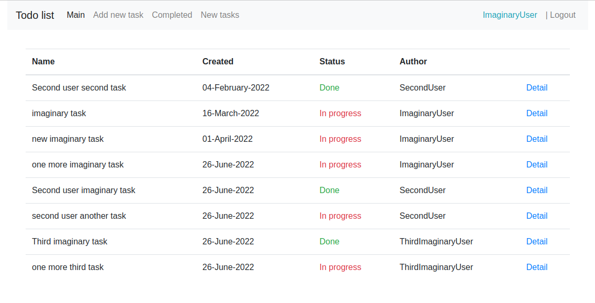
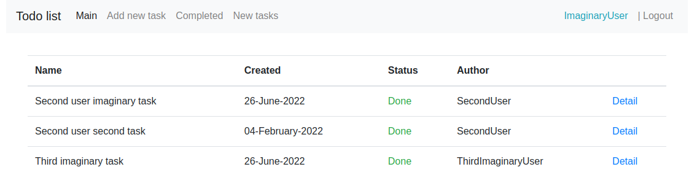

# Todolist — a web service for managing tasks.

<h5>in progress...</h5>
<h2>Technologies</h2>
<ul>
    <li>Spring Boot</li>
    <li>Spring MVC</li>
    <li>Bootstrap</li>
    <li>Thymeleaf</li>
    <li>Hibernate</li>
    <li>Postgres</li>
    <Li>liquibase</Li>
</ul>

### 1. Main page. List of all tasks.

### 2. The page for adding a new task.

### 3. Detail page

### 4. Only new tasks 

### 5. Only completed tasks

